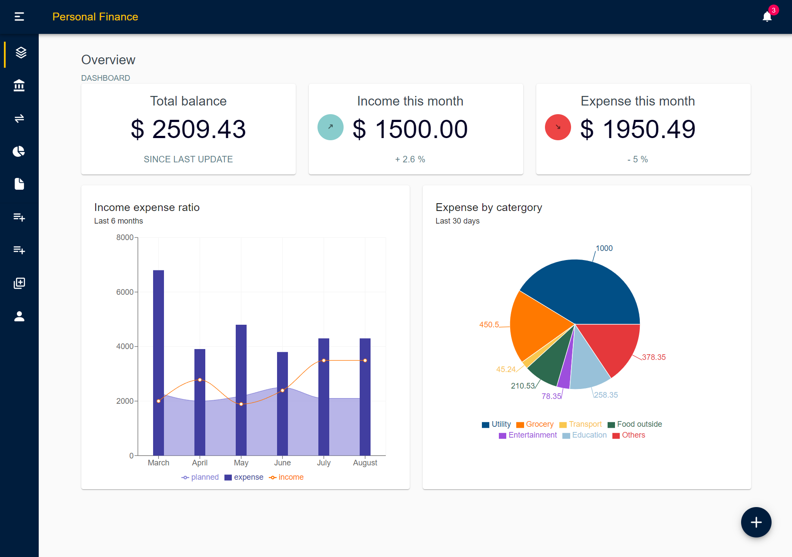
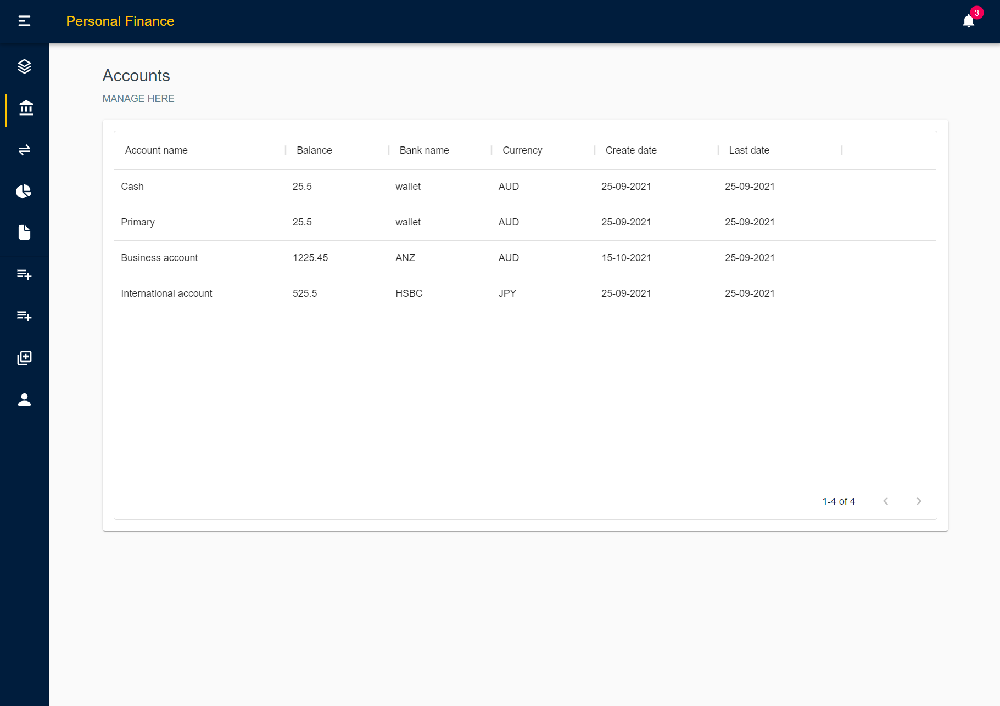
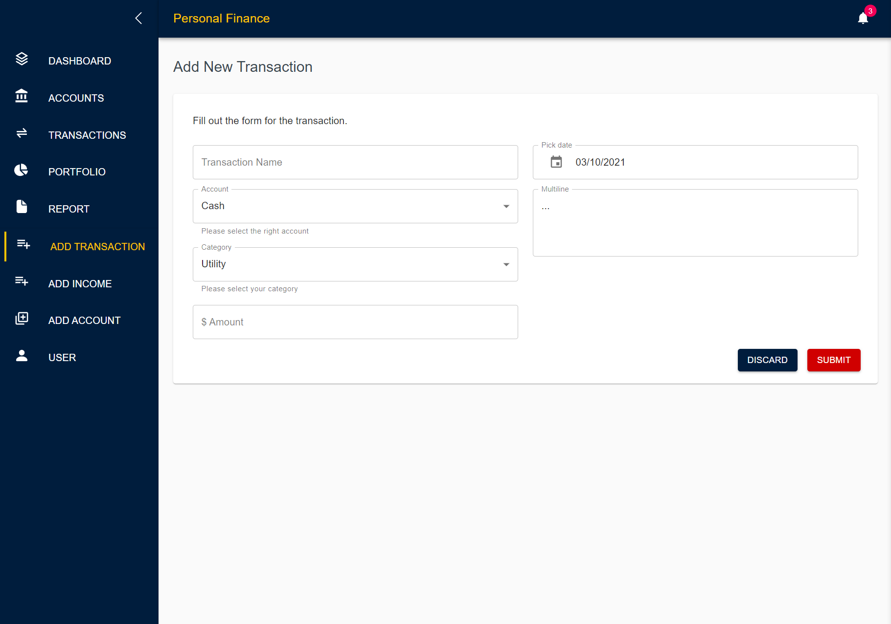

# Personal Finance (Backend)
A fullstack application for tracking users accounts, earning and expenses in one app. 

 

### UI preview
Following are some sample frontend user interfaces for the application.

 Screenshot: Dashboard page

 Screenshot: Data tables page

 Screenshot: Add data forms page

 

### Tools used in the project:
Backend: Java 16, Springboot, Spring Data JPA and MySQL Database.

Frontend part is available at 
[Github Repo](https://github.com/rezwanJamee/personalfinance_frontend).